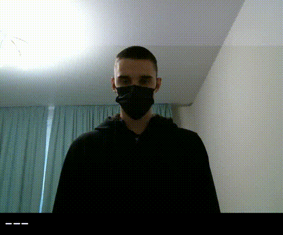

# Slovo - Russian Sign Language Dataset

We introduce a large-scale video dataset **Slovo** for Russian Sign Language task. Slovo dataset size is about **16 GB**, and it contains **20400** RGB videos for **1000** sign language gestures from 194 singers. Each class has 20 samples. The dataset is divided into training set and test set by subject `user_id`. The training set includes 15300 videos, and the test set includes 5100 videos. The total video recording time is ~9.2 hours. About 35% of the videos are recorded in HD format, and 65% of the videos are in FullHD resolution. The average video length with gesture is 50 frames.

For more information see our paper - [arXiv](https://arxiv.org/abs/2305.14527).

## Downloads
### [Main download link](https://rndml-team-cv.obs.ru-moscow-1.hc.sbercloud.ru/datasets/slovo/slovo.zip)

|                                                                                               Downloads | Size (GB) | Comment                                                              |
|--------------------------------------------------------------------------------------------------------:|:----------|:---------------------------------------------------------------------|
|                [Slovo](https://rndml-team-cv.obs.ru-moscow-1.hc.sbercloud.ru/datasets/slovo/slovo.zip) | ~16       | Trimmed HD+ videos by `(start, end)` annotations                     |
|          [Origin](https://rndml-team-cv.obs.ru-moscow-1.hc.sbercloud.ru/datasets/slovo/slovo_full.zip) | ~105      | Original HD+ videos from mining stage                                |
|        [360p](https://rndml-team-cv.obs.ru-moscow-1.hc.sbercloud.ru/datasets/slovo/slovo_full360.zip)  | ~13       | Resized original videos by `min_side = 360`                          |
| [Landmarks](https://rndml-team-cv.obs.ru-moscow-1.hc.sbercloud.ru/datasets/slovo/slovo_mediapipe.json) | ~1.2      | Mediapipe hand landmark annotations for each frame of trimmed videos |

Also, you can download **Slovo** from [Kaggle](https://www.kaggle.com/datasets/kapitanov/slovo).

Annotation file is easy to use and contains some useful columns, see `annotations.csv` file:

|    | attachment_id | user_id | width | height | length |  text  | train   | begin | end |
|---:|:--------------|:--------|------:|-------:|-------:|-------:|:--------|:------|:----|
|  0 | de81cc1c-...  | 1b...   |  1440 |   1920 |     14 | привет | True    | 30    | 45  |
|  1 | 3c0cec5a-...  | 64...   |  1440 |   1920 |     32 |   утро | False   | 43    | 66  |
|  2 | d17ca986-...  | cf...   |  1920 |   1080 |     44 |  улица | False   | 12    | 31  |

where:
- `attachment_id` - video file name
- `user_id` - unique anonymized user ID
- `width` - video width
- `height` - video height
- `length` - video length
- `text` - gesture class in Russian Langauge
- `train` - train or test boolean flag
- `begin` - start of the gesture (for original dataset)
- `end` - end of the gesture (for original dataset)

For convenience, we have also prepared a compressed version of the dataset, in which all videos are processed by the minimum side `min_side = 360`. Download link - **[slovo360p](https://rndml-team-cv.obs.ru-moscow-1.hc.sbercloud.ru/datasets/slovo/slovo_full360.zip)**.
Also, we annotate trimmed videos by using **MediaPipe** and provide hand keypoints in [this annotation file](https://rndml-team-cv.obs.ru-moscow-1.hc.sbercloud.ru/datasets/slovo/slovo_mediapipe.json).

## Models
We provide some pre-trained models as the baseline for Russian sign language recognition.
We tested models with frames number from [16, 32, 48], and **the best for each are below**.
The first number in the model name is frames number and the second is frame interval.

| Model Name        | Model Size (MB) | Metric | ONNX                                                                                                            | TorchScript                                                                                                 |
|-------------------|-----------------|--------|-----------------------------------------------------------------------------------------------------------------|-------------------------------------------------------------------------------------------------------------|
| MViTv2-small-16-4 | 140.51          | 58.35  | [weights](https://rndml-team-cv.obs.ru-moscow-1.hc.sbercloud.ru/datasets/slovo/models/mvit/onnx/mvit16-4.onnx) | [weights](https://rndml-team-cv.obs.ru-moscow-1.hc.sbercloud.ru/datasets/slovo/models/mvit/pt/mvit16-4.pt) |
| MViTv2-small-32-2 | 140.79          | 64.09  | [weights](https://rndml-team-cv.obs.ru-moscow-1.hc.sbercloud.ru/datasets/slovo/models/mvit/onnx/mvit32-2.onnx) | [weights](https://rndml-team-cv.obs.ru-moscow-1.hc.sbercloud.ru/datasets/slovo/models/mvit/pt/mvit32-2.pt) |
| MViTv2-small-48-2 | 141.05          | 62.18  | [weights](https://rndml-team-cv.obs.ru-moscow-1.hc.sbercloud.ru/datasets/slovo/models/mvit/onnx/mvit48-2.onnx) | [weights](https://rndml-team-cv.obs.ru-moscow-1.hc.sbercloud.ru/datasets/slovo/models/mvit/pt/mvit48-2.pt) |
| Swin-large-16-3   | 821.65          | 48.04  | [weights](https://rndml-team-cv.obs.ru-moscow-1.hc.sbercloud.ru/datasets/slovo/models/swin/onnx/swin16-3.onnx) | [weights](https://rndml-team-cv.obs.ru-moscow-1.hc.sbercloud.ru/datasets/slovo/models/swin/pt/swin16-3.pt) |
| Swin-large-32-2   | 821.74          | 54.84  | [weights](https://rndml-team-cv.obs.ru-moscow-1.hc.sbercloud.ru/datasets/slovo/models/swin/onnx/swin32-2.onnx) | [weights](https://rndml-team-cv.obs.ru-moscow-1.hc.sbercloud.ru/datasets/slovo/models/swin/pt/swin32-2.pt) |
| Swin-large-48-1   | 821.78          | 55.66  | [weights](https://rndml-team-cv.obs.ru-moscow-1.hc.sbercloud.ru/datasets/slovo/models/swin/onnx/swin48-1.onnx) | [weights](https://rndml-team-cv.obs.ru-moscow-1.hc.sbercloud.ru/datasets/slovo/models/swin/pt/swin48-1.pt) |
| ResNet-i3d-16-3   | 146.43          | 32.86  | [weights](https://rndml-team-cv.obs.ru-moscow-1.hc.sbercloud.ru/datasets/slovo/models/resnet/onnx/resnet16-3.onnx) | [weights](https://rndml-team-cv.obs.ru-moscow-1.hc.sbercloud.ru/datasets/slovo/models/resnet/pt/resnet16-3.pt) |
| ResNet-i3d-32-2   | 146.43          | 38.38  | [weights](https://rndml-team-cv.obs.ru-moscow-1.hc.sbercloud.ru/datasets/slovo/models/resnet/onnx/resnet32-2.onnx) | [weights](https://rndml-team-cv.obs.ru-moscow-1.hc.sbercloud.ru/datasets/slovo/models/resnet/pt/resnet32-2.pt) |
| ResNet-i3d-48-1   | 146.43          | 43.91  | [weights](https://rndml-team-cv.obs.ru-moscow-1.hc.sbercloud.ru/datasets/slovo/models/resnet/onnx/resnet48-1.onnx) | [weights](https://rndml-team-cv.obs.ru-moscow-1.hc.sbercloud.ru/datasets/slovo/models/resnet/pt/resnet48-1.pt) |

## SignFlow models

| Model Name | Desc                                                                                                                | ONNX                                                                                                    | Params |
|------------|---------------------------------------------------------------------------------------------------------------------|---------------------------------------------------------------------------------------------------------|--------|
| SignFlow-A | **63.3 Top-1** Acc on  [WLASL-2000](https://paperswithcode.com/sota/sign-language-recognition-on-wlasl-2000) (SOTA) | [weights](https://rndml-team-cv.obs.ru-moscow-1.hc.sbercloud.ru/datasets/slovo/models/SignFlow-A.onnx) | 36M    |
| SignFlow-R | Pre-trained on **~50000** samples, has **267** classes, tested with GigaChat (as-is and context-based modes)        | [weights](https://rndml-team-cv.obs.ru-moscow-1.hc.sbercloud.ru/datasets/slovo/models/SignFlow-R.onnx) | 37M    |


## Demo
```console
usage: demo.py [-h] -p CONFIG [--mp] [-v] [-l LENGTH]

optional arguments:
  -h, --help            show this help message and exit
  -p CONFIG, --config CONFIG
                        Path to config
  --mp                  Enable multiprocessing
  -v, --verbose         Enable logging
  -l LENGTH, --length LENGTH
                        Deque length for predictions


python demo.py -p <PATH_TO_CONFIG>
```



## Authors and Credits
- [Kapitanov Alexander](https://www.linkedin.com/in/hukenovs)
- [Kvanchiani Karina](https://www.linkedin.com/in/kvanchiani)
- [Nagaev Alexander](https://www.linkedin.com/in/nagadit/)
- [Petrova Elizaveta](https://www.linkedin.com/in/elizaveta-petrova-248135263/)

## Citation
You can cite the paper using the following BibTeX entry:

    @inproceedings{kapitanov2023slovo,
        title={Slovo: Russian Sign Language Dataset},
        author={Kapitanov, Alexander and Karina, Kvanchiani and Nagaev, Alexander and Elizaveta, Petrova},
        booktitle={International Conference on Computer Vision Systems},
        pages={63--73},
        year={2023},
        organization={Springer}
    }

## Links
- [arXiv](https://arxiv.org/abs/2305.14527)
- [Kaggle](https://www.kaggle.com/datasets/kapitanov/slovo)
- [Habr](https://habr.com/ru/companies/sberdevices/articles/737018/)
- [Medium](https://medium.com/@nagadit/slovo-russian-sign-language-dataset-a8a8bd6fa17d)
- [Github](https://github.com/hukenovs/slovo)
- [Gitlab](https://gitlab.aicloud.sbercloud.ru/rndcv/slovo)
- [Paperswithcode](https://paperswithcode.com/paper/slovo-russian-sign-language-dataset)

## License
<a rel="license" href="http://creativecommons.org/licenses/by-sa/4.0/"></a><br />This work is licensed under a variant of <a rel="license" href="http://creativecommons.org/licenses/by-sa/4.0/">Creative Commons Attribution-ShareAlike 4.0 International License</a>.

Please see the specific [license](https://github.com/hukenovs/slovo/blob/master/license/en_us.pdf).
